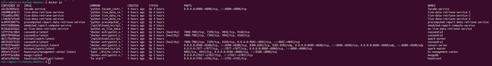
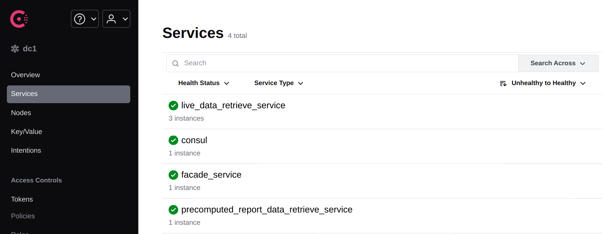
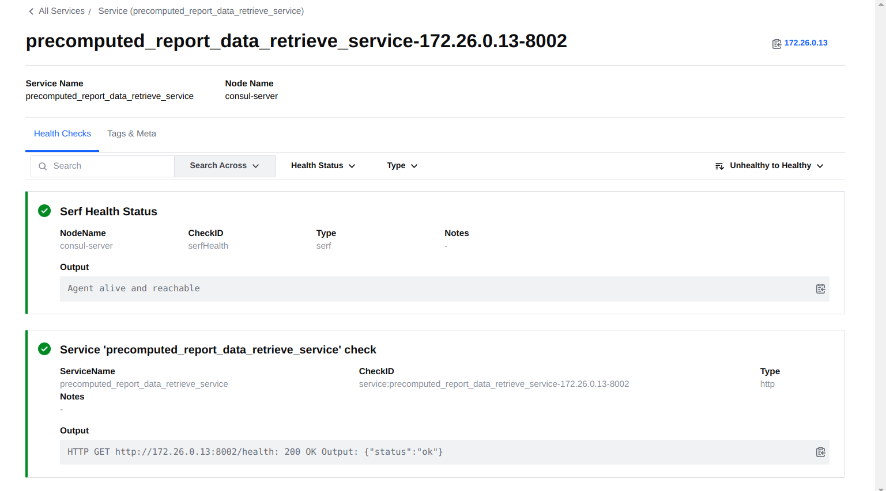
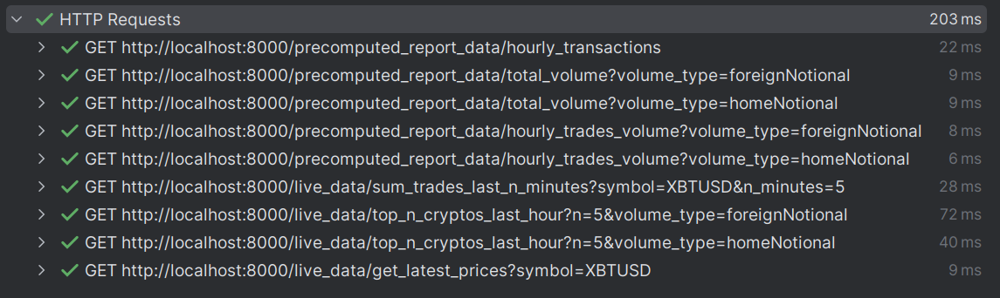
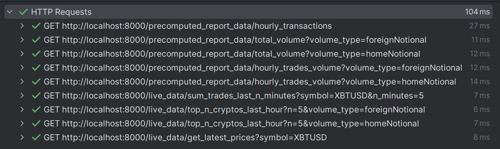

# Cryptocurrency trading data aggregator

Author: Serhii Matsyshyn (https://github.com/serhii-matsyshyn) <br>

## Project short description
Project aims to process and analyze real-time cryptocurrency trades data, while providing users stable access to processed data.  
The platform continuously collects data through cryptocurrency exchange websocket and provides users with valuable statistics through REST API endpoints.  
REST API is divided into two main categories - precomputed report data that is computed every hour, and live data that is either real-time or 1 minute cached data (depending on the endpoint).  
  
Data the project provides can be useful for automatic trading bots creation.

## System architecture diagram


## Roles of microservices and reasoning of the architecture

- WS live data retrieve service - constantly, in real time, receives data from the websocket of the cryptocurrency exchange (data received with a high frequency). Stores data in Cassandra Cluster.
  - It is subscribed and receives data from `tradeBin1m` and `quote` websocket Bitmex topics.  
  - No additional processing is done on the data, it is stored in Cassandra in the same format as received from the exchange.
  - Saving all the data allows for further detailed analysis and processing of the data.

Part A:
- Scheduled report compute service 
  - Uses Apache Spark connected to Cassandra Cluster to generate advanced data reports every hour.
  - Apache Spark is chosen because it is optimized for heavy and advanced data processing that is impossible with Cassandra alone.
  - Stores advanced reports in MongoDB.
  - MongoDB (rather than Cassandra) is chosen here because MongoDB is optimized and more efficient for heavy read loads, while Cassandra is better for heavy write loads.
- Precomputed report data retrieve service
  - It is a microservice that receives advanced reports from MongoDB.
  - The Facade Service and the Precomputed Report Data Retrieve Service are separated because it contributes to modularity, scalability, and facilitates independent maintenance and upgrade of microservices.

Part B:
- Streaming (live) data retrieve service
  - The service responsible for getting the latest data from the Cassandra Cluster.  
  - Since sum trades last n minutes and top n cryptos last hour have a specific behavior (necessary in trading), namely, they return the result excluding the data of the last minute (since it is not yet considered "closed"), then these queries and responses are cached using Hazelcast.  
    Thus, the unnecessary load on the Cassandra Cluster is reduced and the speed of operation is increased, which is quite critical, since Part B is a highly loaded (with a possible large number of requests from clients).  
  - Facade Service and Streaming (live) data retrieve service exchange data are based on the Publish-Subscribe pattern. That is, there is one queue where Facade Service clients send the necessary requests, one of the free Streaming (live) data retrieve microservices processes it and returns a response to the Hazelcast Topic, which was previously defined and provided together with the Facade Service client.  
  - The Publish-Subscribe pattern is used to reduce latency during the internal interaction of microservices - since, in the case of HTTP, you need to constantly establish and stop connections, this implementation can avoid this.  
  - This microservice can be scaled as simply and quickly as possible by launching additional instances of the microservice.  

- Facade Service - provides an HTTP Rest API to the client. You can find example requests [here](facade_service/Requests.http).

## REST API
**Note: you should get acquainted with the [`Information on volume type` section](#information-on-volume-type) beforehand**  

The following REST APIs are available:  

Part A: A set of REST APIs that will return the precomputed report data. The data for these reports would be prepared in advance with batch processing operations:
1. Return the aggregated statistics containing the number of transactions for each cryptocurrency for each hour in the last 6 hours, excluding the previous hour.
2. Return the statistics about the total trading volume for each cryptocurrency for the last 6 hours, excluding the previous hour.
3. Return aggregated statistics containing the number of trades and their total volume for each hour in the last 12 hours, excluding the current hour.

Part B: A set of REST APIs that will return the results of ad-hoc queries. User provides parameters to the API and it should respond according to the specified values:
1. Return the number of trades processed in a specific cryptocurrency in the last N minutes, excluding the last minute.
2. Return the top N cryptocurrencies with the highest trading volume in the last hour.
3. Return the cryptocurrency’s current price for «Buy» and «Sell» sides based on its symbol.

**You can find example requests [here - facade_service/Requests.http](facade_service/Requests.http)**

## Data models
### Cassandra
The data is stored in the same format, as received from the Bitmex exchange websocket. This data was considered as the most optimal for further processing and analysis, and no additional transformations need to be done.
```cassandraql
CREATE TABLE IF NOT EXISTS tradeBin1m (
    timestamp TIMESTAMP,
    symbol TEXT,
    open DOUBLE,
    high DOUBLE,
    low DOUBLE,
    close DOUBLE,
    trades BIGINT,
    volume DOUBLE,
    lastSize DOUBLE,
    turnover DOUBLE,
    homeNotional DOUBLE,
    foreignNotional DOUBLE,
    PRIMARY KEY (symbol, timestamp)
);

CREATE TABLE IF NOT EXISTS quote (
    timestamp TIMESTAMP,
    symbol TEXT,
    bidSize BIGINT,
    bidPrice DOUBLE,
    askPrice DOUBLE,
    askSize BIGINT,
    PRIMARY KEY (symbol, timestamp)
);
```
### MongoDB
The data is stored in the following format for each specified report:
```json
# hourly_transactions
[
    {
      "symbol": "XBTUSD",
      "hour": 14,
      "transaction_count": 7359
    },
        ...
    {
      "symbol": "ETHUSD",
      "hour": 15,
      "transaction_count": 2146
    },
    {
      "symbol": "ETHUSD",
      "hour": 14,
      "transaction_count": 1577
    }
]

# total_volume_foreignNotional and total_volume_homeNotional
[
    {
      "symbol": "XBTUSD",
      "total_volume": 108424100.0
    },
    {
      "symbol": "ETHUSD",
      "total_volume": 12182156.518077983
    },
        ...
]

# hourly_trades_volume
[
    {
      "hour": 15,
      "trade_count": 16222,
      "total_volume": 43904053.3212963
    },
    {
      "hour": 14,
      "trade_count": 15309,
      "total_volume": 34597847.73764679
    },
        ...
]
```

### Output data (REST API)
Live data retrieve service returns the following data:
```json
# sum_trades_last_n_minutes
{
  "symbol": "XBTUSD",
  "total_trades": 168,
  "start_timestamp": "2024-05-06T17:20:00",
  "end_timestamp": "2024-05-06T17:25:00"
}

# top_n_cryptos_last_hour
{
  "top_cryptos": {
    "XBTUSD": 13836200.0,
    "XBTUSDT": 1403192.889,
    "ETHUSD": 1123946.4544920032,
    "XRPUSD": 428559.96834503894,
    "SOLUSD": 285567.21252443903
  },
  "volume_type": "foreignNotional",
  "start_timestamp": "2024-05-06T16:25:00",
  "end_timestamp": "2024-05-06T17:25:00"
}

# get_latest_prices
{
  "symbol": "XBTUSD",
  "bidPrice": 63272.5,
  "askPrice": 63273.0,
  "timestamp": "2024-05-06T17:25:43.711000"
}
```
Precomputed report data retrieve service returns the following data (retrieved from MongoDB):
```json
{
  "report_date": "2024-05-06T17:25:43.711000",
  "report_name": "name",
  "data": [...]
}
```

## 🖥 Usage

### Requirements
- Docker
- Docker-compose
- Python 3.10 or higher
- Pip

It is necessary to install the required Python packages on the host machine (for easy deployment):
```shell
pip3 install -r infrastructure_services/requirements.txt
```

### Infrastructure services
```shell
cd infrastructure_services
./start-infrastructure-services.sh
```

### Docker compose run all services
It is possible to use the following command to run all services, but it may cause docker-compose and build merge issues:
```shell
sudo docker-compose -f ws_live_data_retrieve_service/docker-compose.yml \
                    -f sheduled_report_compute_service/docker-compose.yml \
                    -f precomputed_report_data_retrieve_service/docker-compose.yml \
                    -f live_data_retrieve_service/docker-compose.yml \
                    -f facade_service/docker-compose.yml \
up
```

For an easy debug, you can run each service separately (it is recommended to use this method):
```shell
sudo docker-compose -f ws_live_data_retrieve_service/docker-compose.yml up -d
sudo docker-compose -f sheduled_report_compute_service/docker-compose.yml up -d
sudo docker-compose -f precomputed_report_data_retrieve_service/docker-compose.yml up -d
sudo docker-compose -f live_data_retrieve_service/docker-compose.yml up -d
sudo docker-compose -f facade_service/docker-compose.yml up -d
```

### To attach to logs of service:
```shell
sudo docker container logs -f ws-live-data-retrieve-service
```

### To stop a certain service only (useful for debugging):
```shell
sudo docker stop live-data-retrieve-service-1
```

### To stop all services:
```shell
sudo docker-compose -f ws_live_data_retrieve_service/docker-compose.yml down
sudo docker-compose -f sheduled_report_compute_service/docker-compose.yml down
sudo docker-compose -f precomputed_report_data_retrieve_service/docker-compose.yml down
sudo docker-compose -f live_data_retrieve_service/docker-compose.yml down
sudo docker-compose -f facade_service/docker-compose.yml down
sudo docker-compose -f infrastructure_services/docker-compose-infrastructure.yml down
```
### To rebuild all services:
```shell
sudo docker-compose -f ws_live_data_retrieve_service/docker-compose.yml build --no-cache
sudo docker-compose -f sheduled_report_compute_service/docker-compose.yml build --no-cache
sudo docker-compose -f precomputed_report_data_retrieve_service/docker-compose.yml build --no-cache
sudo docker-compose -f live_data_retrieve_service/docker-compose.yml build --no-cache
sudo docker-compose -f facade_service/docker-compose.yml build --no-cache
```

### Services ports

- facade_service: 8000
- sheduled_report_compute_service: 8001
- precomputed_report_data_retrieve_service: 8002
- ws_live_data_retrieve_service: 8003
- live_data_retrieve_service: 8004 - 8006
and other services ports
- Hazelcast: 5701
- Hazelcast Management Center: 8180
- Consul: 8500
- Spark: 8080
- MongoDB: 27017

## Demonstration of the system
The system was up and running for 5 hours before the demonstration. The demonstration was run at 17:25 UTC (20:25 Kyiv time).
You can see active services in docker ps:

The health checks (Consul by HashiCorp) of the API-available services are successful:


The following requests were made to the facade service: [see this Requests.http file](facade_service/Requests.http)

Execution time of the requests:

Subsequent requests time (within 1 minute):

We can see that using distributed cache (Hazelcast) significantly reduces the response time of the live service (that have 1 minute cache - `top_n_cryptos_last_hour`, `sum_trades_last_n_minutes`).

Please find attached the responses to the requests in the [data/demonstration](data/demonstration) folder. The files are named a_1.json, a_2.1.json, etc. as per the request number in the [facade_service/Requests.http](facade_service/Requests.http) file.  
Note, that responses data is sorted by transactions number and volume in descending order (where applicable).

## 📌 Nota bene
Project was developed and tested on Ubuntu 22.04.3 LTS.  
UTC time is used in the project.  

### Information on volume type
The reason for having separate endpoints params (`foreignNotional`, `homeNotional`) is input data format - Bitmex's unique method of reporting trading volume. Bitmex doesn't provide a unified volume value in a fixed currency like USD (or BTC); instead, it offers volume data in various forms such as home, foreign, or relative points based on the specific cryptocurrency pairs being traded.

Sorting by volume can present challenges in interpretation. For instance, if using `volume` value (that is, relative points) or `homeNotional`, cryptocurrencies like PEPE with a high number of digits may appear to have a higher volume than BTC, despite BTC being a more widely traded asset. This discrepancy arises due to the differing digit counts in their respective representations (and mixed `volume` representation across pairs).

Using `foreignNotional` as the volume type offers a more stable calculation. This is because most cryptocurrencies on Bitmex are paired with USD-based assets like USD, USDT, or USDC. However, there are exceptions such as BTCETH pairs, which can introduce some complexity.

Unfortunately, it's impractical to split pairs or calculate a relative volume value due to the limitations of Bitmex's data reporting. As a result, separate endpoints params are necessary to provide clarity on trading volume metrics based on different volume types, and still, there are several pairs that will be incorrectly sorted, if their `foreignNotional` is not USD-based.
